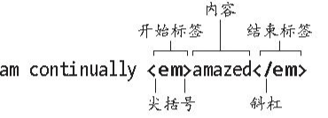
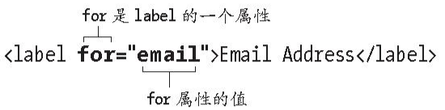

一个网页主要包括以下三个部分。

文本内容（text content）：在页面上让访问者了解页面内容的纯文字，比如关于业务、产品、家庭度假的内容，以及页面关注的其他任何内容。
对其他文件的引用（references to other files）：我们使用这些引用来加载图像、音频、视频文件，以及样式表（控制页面的显示效果）和JavaScript文件（为页面添加行为）。这些引用还可以指向其他的HTML页面和资源。
标记（markup）：对文本内容进行描述并确保引用正确地工作。（HTML一词中的字母M就代表标记。）

## HTML思想

类似地，HTML元素描述的是内容是什么，而非看起来是什么样。CSS（从第7章开始讲解）才控制内容的外观（如字体、颜色、阴影等）。

## 基本的HTML页面

### 网页的顶部和头部

实际上,\<body\>开始标签以上的内容都是为浏览器和搜索引擎准备的。

### 网页的主体：你的内容

## 标签：元素、属性、值及其他

### 元素

大多数元素既包含文本，也包含其他元素（就像基本页面中的p元素）。如前面提到的，这些元素由开始标签、内容和结束标签组成。开始标签是放在一对尖括号中的元素的名称及可能包含的属性，结束标签是放在一对尖括号中的斜杠加元素的名称（参见图1.3.1）。

### 属性和值
属性包含了元素的额外信息（参见图1.3.3和图1.3.4）。在HTML5中，属性值两边的引号是可选的，但习惯上大家还是会写上，因此建议始终这样做。跟元素的名称一样，尽量使用小写字母编写属性的名称。

### 父元素和子元素
如果一个元素包含另一个元素，它就是被包含元素的父元素，被包含元素称为子元素。子元素中包含的任何元素都是外层的父元素的后代（参见图1.3.7）。这种类似家谱的结构是HTML代码的关键特性，它有助于在元素上添加样式（从第7章开始讨论）和应用JavaScript行为（不在本书介绍范围）。

## 网页的文本内容
元素中包含的文本可能是网页上最基本的成分。如果你用过文字处理软件，那么你一定输入过文本。不过，HTML页面中的文本有一些重要的差异。
首先，浏览器呈现HTML时，会把文本中的多个空格或制表符压缩成单个空格，把回车符和换行符转换成单个空格，或者将它们一起忽略（参见图1.4.1和图1.4.2）。

## 链接、图像和其他非文本内容
显然，万维网充满生机的部分原因是页面之间的链接，以及图像、视频、音乐等。外部文件（如图像）实际上并没有放在HTML文件中，而是单独保存的，页面只是简单地引用了这些文件（参见图1.5.1）。

## 文件名和文件夹名

同其他文本文件一样，网页也有文件名。对网页文件命名时要记住几点，这些要点有助于对文件进行组织，使访问者更容易找到并访问你的页面，确保他们的浏览器能正确地处理页面，以及增强搜索引擎优化（SEO），参见图1.6.1和图1.6.2。（注意，本书会替换使用“文件夹”和“目录”，它们表示的含义相同。）

