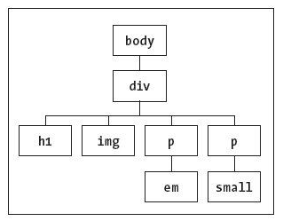
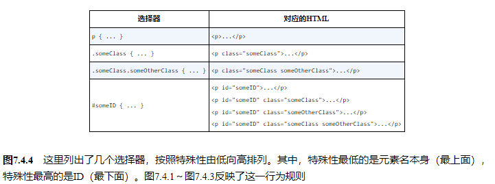

## 构造样式规则

样式表中包含了定义网页外观的规则。样式表中的每条规则都有两个主要部分：**选择器**（selector）和**声明块**（declaration block）。选择器决定哪些元素受到影响；声明块由一个或多个属性-值对（每个属性-值对构成一条**声明**，declaration）组成，它们指定应该做什么

```css
selector {
	property:value;
}
```


## 理解继承

**继承**（inheritance）是CSS里一个很重要的概念。看看图7.3.1所示的网页。浏览器会将这份HTML理解为图7.3.2所示的文档树。文档树有助于你理解CSS。原因是，当你为某个元素应用CSS属性时，这些属性不仅会影响该元素，还会影响其下的分支元素。



此外，对大多数属性来说，还可以使用`inherit`值强制进行继承


## 层叠：当规则发生冲突时

应用样式有三种方式：从一个或多个外部文件导入（推荐），如图7.4.1中的代码所示，插入到HTML文档的顶部，或直接应用于代码中特定的HTML元素上（不过，应该尽可能地避免这样做）。下一章将具体讲解三种方式。

然而，有时候多条规则会定义元素的**同一个**属性（参见图7.4.1），这时该怎么办呢？CSS用层叠的原则来考虑样式声明，从而判断相互冲突的规则中哪个规则应该起作用。首先，你编写的样式如果与浏览器的默认样式冲突，均以你编写的样式为准。在此基础上，CSS用层叠的原则来考虑**特殊性**（specificity）、**顺序**（order）和**重要性**（importance），从而判断相互冲突的规则中哪个规则应该起作用。


### 特殊性

**特殊性**规则指定选择器的具体程度。选择器越特殊，规则就越强。遇到冲突时，优先应用特殊性强的规则，



不过现在要提一句，建议在样式表中多使用类选择器，避免使用ID选择器。使用ID选择器通常会矫枉过正，降低了灵活性。


### 顺序

有时候，特殊性还不足以判断在相互冲突的规则中应该优先应用哪一个。在这种情况下，规则的**顺序**就可以起到决定作用：晚出现的优先级高（参见图7.4.1、图7.4.2和图7.4.3）。例如，直接应用在HTML元素上的规则（不推荐使用这种做法）被认为比外部样式表中或插在HTML文档顶部的特殊性相同的规则出现得更晚（因此优先级更高）。

### 重要性

如果这还不够，可以声明一条特殊的规则覆盖整个系统中的规则，这条规则的重要程度要比其他所有规则高。也可以在某条声明的末尾加上`!important`，比如`p{ color: orange !important; }`（除非是在特殊情况下，否则不推荐使用这种方法）。

## 属性的值

### inherit

对于任何属性，如果希望显式地指出该属性的值与对应元素的父元素对该属性设定的值相同，就可以使用`inherit`值。

### 预定义的值

大多数CSS属性都有一些可供使用的预定义值。例如，`float`属性可被设为`left`、`right`或`none`。与HTML不同，不需要（也**不能**）将预定义的值放在引号里

### 长度和百分数

很多CSS属性的值是长度。所有长度都必须包含数字和单位，并且它们之间没有空格。例如`3em`、`10px`

### 纯数字

只有极少数的CSS属性接受不带单位的数字，如`3`、`0.65`。其中最常见的就是`line-height`（参见图7.5.4）、`z-index`和`opacity`（分别参见10.7节、11.15节和14.8节）。

### URL

有的CSS属性允许开发人员指定另一个文件（尤其是图像）的URL，`background-image`就是这样一个属性。在这种情况下，使用`url(*file.ext*)`，其中`*file.ext*`是目标资源的路径和文件名，参见图7.5.5。注意，规范指出，相对URL应该相对于样式表的位置而不是相对于HTML文档的位置。

### CSS颜色

我们可以使用预定义颜色关键字或以十六进制（通常称为hex）、RGB、HSL、RGBA、HSLA等格式表示的值中为CSS属性指定颜色。最后两种格式可以指定具有一定程度alpha透明度的颜色。HSL、RGBA和HSLA格式都是在CSS3中引入的。

### RGB

### 十六进制数